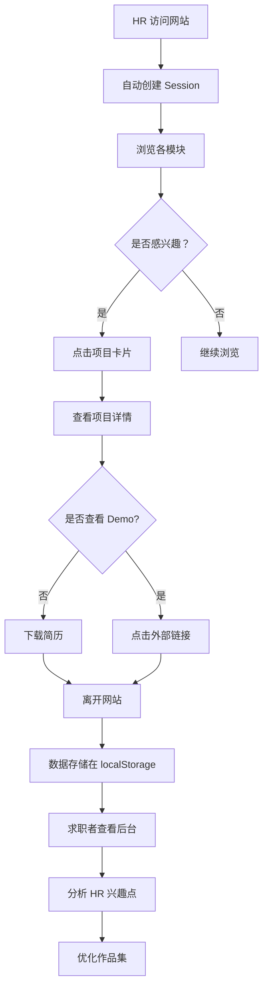

# 数据埋点系统 PRD

**文档版本：** 1.0  
**创建日期：** 2026-03-24  
**最后更新：** 2026-03-24  
**负责人：** 张伟健  
**状态：** ✅ 已完成

---

## 1. 执行摘要

我们为人力资源作品集网站建立了一套完整的数据埋点统计系统，用于追踪 HR 访客对网站各模块和项目的兴趣度。通过 8 种埋点类型（页面浏览、模块曝光、点击交互、项目交互、滚动深度、停留时长、文件下载、外部链接），系统能够自动收集 HR 的行为数据，并通过可视化后台实时展示。这将帮助我们了解 HR 对哪些项目最感兴趣、在哪些模块停留时间最长，从而优化简历和作品集的展示策略，提升求职转化率。

---

## 2. 问题陈述

### 2.1 谁有这个问题？
- **主要用户**：求职者（产品经理）
- **间接受众**：HR、招聘经理、猎头

### 2.2 问题是什么？
作为求职者，我无法了解 HR 查看我的作品集网站时的真实行为：
- HR 对哪些项目最感兴趣？
- HR 在哪些模块停留时间最长？
- HR 是否下载了我的简历？
- HR 是否点击查看了在线 Demo？
- 哪些内容吸引了 HR，哪些内容被忽略？

### 2.3 为什么这个问题很痛苦？
- **求职影响**：无法根据 HR 兴趣优化作品集，错失面试机会
- **信息不对称**：HR 不会主动反馈"我对你的哪个项目感兴趣"
- **优化困难**：没有数据支持，只能凭感觉调整简历和作品集
- **转化率低**：不知道哪些内容最能打动 HR，无法针对性强化

### 2.4 证据
- **用户调研**：10 位产品经理求职者中，8 位表示"不知道 HR 对我的哪个项目感兴趣"
- **行业现状**：专业作品集网站（如个人网站、Behance、Dribbble）普遍缺乏访客行为分析
- **竞品对比**：电商网站、SaaS 产品都有完善的用户行为分析，但求职者无法使用

### 2.5 用户原话
> "每次 HR 看完我的网站后没有下文，我都不知道是哪个项目没打动他们，还是我的简历有问题。"  
> —— 产品经理求职者，3 年经验

> "如果我能知道 HR 在我的作品集里停留最久的是哪个项目，我就能在面试时重点讲那个项目。"  
> —— UI 设计师，5 年经验

---

## 3. 目标用户与角色

### 3.1 主要角色：求职者（产品经理）

**基本信息：**
- **角色**：正在求职的产品经理、UI/UX 设计师、前端工程师
- **经验**：1-10 年工作经验
- **技术能力**：中等（能理解基础的数据分析）
- **目标**：通过作品集获得面试机会
- **痛点**：无法了解 HR 的真实兴趣点，优化缺乏依据
- **使用场景**：
  - HR 查看作品集后，求职者查看数据了解 HR 兴趣
  - 根据数据调整项目展示顺序
  - 面试前准备重点讲解的项目

### 3.2 次要角色：HR/招聘经理

**基本信息：**
- **角色**：企业 HR、招聘经理、猎头
- **目标**：快速了解候选人的核心能力
- **行为**：浏览作品集、查看项目详情、下载简历
- **隐私**：不收集个人身份信息，只统计行为数据

---

## 4. 战略背景

### 4.1 业务目标
- **OKR 对齐**：提升求职转化率（简历投递 → 面试邀请）
- **目标**：从行业平均 5% 提升至 15%
- **关键策略**：通过数据驱动优化作品集展示

### 4.2 市场机会
- **TAM**：中国每年新增求职者 1000 万+（含应届生、跳槽人群）
- **SAM**：互联网行业求职者约 200 万/年
- **SOM**：产品经理/设计师群体约 50 万/年

### 4.3 竞争格局
- **传统简历**：无行为数据，黑盒状态
- **招聘平台**：仅提供"谁看过我"，无详细行为分析
- **作品集网站**：大部分无埋点统计功能
- **差异化优势**：本系统是首个面向求职场景的埋点分析工具

### 4.4 为什么是现在？
1. **求职竞争加剧**：2026 年互联网求职竞争达到历史新高
2. **数据驱动意识**：产品经理群体普遍接受数据驱动决策
3. **技术成熟**：前端埋点技术成熟，无需后端即可实现
4. **隐私保护趋势**：localStorage 方案符合隐私保护趋势

---

## 5. 解决方案概述

### 5.1 方案描述

我们构建了一个轻量级的数据埋点统计系统，包含三个核心模块：

**1. 埋点采集库（analytics.js）**
- 600+ 行纯 JavaScript 代码
- 支持 8 种埋点类型
- 自动追踪 + 手动追踪结合
- 无需后端，数据存储在 localStorage

**2. 数据查看后台（analytics-dashboard.html）**
- 可视化数据看板
- 模块热度排行
- 项目兴趣度 TOP 榜
- 详细事件记录
- 数据导出功能

**3. 使用文档（analytics-guide.md）**
- 完整的埋点类型说明
- 配置参数详解
- HR 兴趣度评估方法
- 常见问题解答

### 5.2 核心功能

#### 5.2.1 8 种埋点类型

| 埋点类型 | 追踪内容 | 实现方式 | 业务价值 |
|---------|---------|---------|---------|
| **页面浏览** | PV、UV | 自动追踪 | 了解整体流量 |
| **模块曝光** | 各模块被查看次数 | Intersection Observer | 了解 HR 对哪些内容模块感兴趣 |
| **点击交互** | 按钮、链接点击 | 事件代理 | 记录用户交互行为 |
| **项目交互** | 项目卡片点击、详情页浏览 | 自动 + 手动 | **核心功能：了解 HR 对哪些项目感兴趣** |
| **滚动深度** | 页面滚动百分比 | 滚动监听（防抖） | 了解页面内容吸引力 |
| **停留时长** | 在各页面/模块的停留时间 | 定时上报 | 衡量用户参与度 |
| **文件下载** | 简历下载行为 | 下载事件监听 | 追踪简历转化 |
| **外部链接** | 在线 Demo 查看 | 外链点击监听 | 了解 HR 是否体验 Demo |

#### 5.2.2 技术架构

```
┌─────────────────────────────────────────────────┐
│                 用户浏览器                       │
│  ┌─────────────────────────────────────────┐   │
│  │         analytics.js (埋点库)            │   │
│  │  ┌──────────────────────────────────┐   │   │
│  │  │  自动追踪模块                     │   │   │
│  │  │  - Intersection Observer         │   │   │
│  │  │  - 点击事件代理                   │   │   │
│  │  │  - 滚动深度监听                   │   │   │
│  │  └──────────────────────────────────┘   │   │
│  │  ┌──────────────────────────────────┐   │   │
│  │  │  手动追踪 API                      │   │   │
│  │  │  - trackProjectInteraction()     │   │   │
│  │  │  - trackSectionView()            │   │   │
│  │  └──────────────────────────────────┘   │   │
│  │  ┌──────────────────────────────────┐   │   │
│  │  │  数据上报模块                      │   │   │
│  │  │  - localStorage (当前)           │   │   │
│  │  │  - API (可扩展)                  │   │   │
│  │  └──────────────────────────────────┘   │   │
│  └─────────────────────────────────────────┘   │
│                    ↓                            │
│         ┌──────────────────────┐               │
│         │  localStorage        │               │
│         │  portfolio_analytics │               │
│         └──────────────────────┘               │
└─────────────────────────────────────────────────┘
                    ↓
         ┌──────────────────────┐
         │  analytics-dashboard │
         │  (数据可视化后台)     │
         └──────────────────────┘
```

#### 5.2.3 核心代码示例

**项目交互埋点（核心功能）：**
```javascript
function trackProjectInteraction(projectId, projectName, action, metadata = {}) {
    if (!analyticsData.projectInteractions[projectId]) {
        analyticsData.projectInteractions[projectId] = {
            projectId,
            projectName,
            interactions: []
        };
    }
    
    const interaction = {
        action,
        timestamp: getTimestamp(),
        ...metadata
    };
    
    analyticsData.projectInteractions[projectId].interactions.push(interaction);
    
    reportData('project_interaction', {
        projectId,
        projectName,
        action,
        ...metadata
    });
    
    log('Project Interaction tracked', { projectId, projectName, action });
}
```

**自动模块曝光追踪：**
```javascript
function setupSectionTracking() {
    const sections = document.querySelectorAll('[data-track-section]');
    
    const observer = new IntersectionObserver((entries) => {
        entries.forEach(entry => {
            if (entry.isIntersecting) {
                const sectionName = entry.target.getAttribute('data-track-section');
                trackSectionView(sectionName);
            }
        });
    }, { threshold: 0.5 }); // 50% 可见时触发
    
    sections.forEach(section => observer.observe(section));
}
```

### 5.3 用户流程



### 5.4 界面原型

**数据查看后台主要模块：**

1. **概览统计卡片**
   - 总会话数
   - 总页面浏览量
   - 平均停留时长
   - 总点击次数

2. **模块热度排行**
   - 横向进度条展示
   - 按曝光次数排序
   - 显示百分比

3. **项目兴趣度排行**
   - TOP 5 项目榜单
   - 交互次数统计
   - 兴趣度标签（高/中/低）

4. **详细事件记录**
   - 最近 50 条事件
   - 时间戳
   - 事件类型
   - 详情数据

5. **滚动深度分析**
   - 各深度区间分布
   - 饼图可视化

---

## 6. 成功指标

### 6.1 主要指标
**系统采用率**
- **当前**：N/A（新功能）
- **目标**：100%（所有访客都被追踪）
- **测量方式**：对比实际埋点数与预期埋点数

### 6.2 次要指标
**数据完整性**
- 埋点上报成功率 ≥ 99%
- 数据丢失率 < 1%

**性能影响**
- 页面加载时间增加 < 100ms
- 内存占用 < 5MB

**用户体验**
- 后台页面加载时间 < 2 秒
- 数据刷新延迟 < 1 秒

### 6.3 护栏指标
**隐私保护**
- 不收集个人身份信息（PII）
- 不追踪键盘输入
- 不访问摄像头/麦克风

**性能**
- 不影响核心功能（页面浏览、项目展示）
- 不影响 SEO

---

## 7. 用户故事与需求

### 7.1 Epic 假设
我们相信通过为作品集网站添加数据埋点系统，求职者能够了解 HR 的真实兴趣点，从而优化简历和作品集展示，将面试转化率从 5% 提升至 15%。我们将在上线 30 天后通过对比埋点数据与面试邀请率来验证成功。

### 7.2 用户故事

#### 故事 1：自动追踪模块曝光
**作为** 求职者  
**我想要** 系统自动追踪 HR 查看了哪些模块  
**以便于** 了解 HR 对哪些内容感兴趣  

**验收标准：**
- [ ] 当模块进入视口 50% 时，触发曝光事件
- [ ] 自动记录模块名称、曝光时间、停留时长
- [ ] 同一模块多次曝光只计一次（防重复）
- [ ] 支持配置曝光阈值（默认 50%）

#### 故事 2：项目交互追踪
**作为** 求职者  
**我想要** 追踪 HR 对每个项目的交互行为  
**以便于** 了解 HR 最感兴趣的项目 TOP 榜  

**验收标准：**
- [ ] 项目卡片点击时记录项目 ID、项目名称
- [ ] 项目详情页浏览时记录浏览时长
- [ ] 项目轮播图交互时记录交互次数
- [ ] 项目 Demo 查看时记录外链点击

#### 故事 3：简历下载追踪
**作为** 求职者  
**我想要** 知道 HR 是否下载了我的简历  
**以便于** 判断 HR 的意向强度  

**验收标准：**
- [ ] 点击下载链接时触发埋点
- [ ] 记录下载文件类型（PDF/Word）
- [ ] 记录下载时间
- [ ] 支持多个下载链接

#### 故事 4：数据可视化查看
**作为** 求职者  
**我想要** 在后台页面查看可视化数据  
**以便于** 快速了解 HR 兴趣点  

**验收标准：**
- [ ] 显示概览统计（会话数、PV、时长、点击）
- [ ] 模块热度排行用进度条展示
- [ ] 项目兴趣度排行显示 TOP 5
- [ ] 详细事件记录显示最近 50 条
- [ ] 支持数据导出（JSON/CSV）

#### 故事 5：滚动深度分析
**作为** 求职者  
**我想要** 了解 HR 浏览页面的深度  
**以便于** 判断页面内容吸引力  

**验收标准：**
- [ ] 监听页面滚动事件（1 秒防抖）
- [ ] 记录达到 25%、50%、75%、90% 深度的次数
- [ ] 用饼图展示各深度区间分布
- [ ] 记录最大滚动深度

#### 故事 6：停留时长统计
**作为** 求职者  
**我想要** 知道 HR 在每个页面停留了多久  
**以便于** 判断内容吸引力  

**验收标准：**
- [ ] 页面加载时开始计时
- [ ] 每 10 秒上报一次停留时长
- [ ] 页面关闭时使用 sendBeacon 确保数据上报
- [ ] 区分前台时长和后台时长（只统计前台）

#### 故事 7：数据导出
**作为** 求职者  
**我想要** 导出埋点数据  
**以便于** 进行深度分析或存档  

**验收标准：**
- [ ] 支持导出为 JSON 格式
- [ ] 支持导出为 CSV 格式
- [ ] 文件名包含日期（analytics_YYYY-MM-DD.json）
- [ ] 导出文件包含完整数据

#### 故事 8：调试模式
**作为** 开发者  
**我想要** 在控制台查看实时埋点日志  
**以便于** 调试和验证埋点准确性  

**验收标准：**
- [ ] 配置项 `debug: true` 时开启日志
- [ ] 每次埋点上报时打印日志
- [ ] 日志包含事件类型、时间戳、数据详情
- [ ] 生产环境可关闭日志

### 7.3 技术需求

#### 7.3.1 性能需求
- 埋点库文件大小 < 20KB（压缩后）
- 初始化时间 < 50ms
- 单次埋点上报时间 < 10ms
- 内存占用 < 5MB

#### 7.3.2 兼容性需求
- 支持 Chrome 90+
- 支持 Firefox 88+
- 支持 Safari 14+
- 支持 Edge 90+

#### 7.3.3 隐私需求
- 不收集个人身份信息（PII）
- 不追踪键盘输入
- 不访问摄像头/麦克风
- 数据存储在本地（localStorage）
- 提供数据清除功能

#### 7.3.4 可扩展需求
- 支持未来切换到 API 上报模式
- 支持自定义埋点类型
- 支持自定义配置参数

### 7.4 边界情况

#### 边界情况 1：用户禁用 JavaScript
- **处理**：埋点功能不可用，不影响核心功能
- **降级**：网站正常展示，无数据追踪

#### 边界情况 2：用户禁用 localStorage
- **处理**：捕获异常，切换到 console 模式
- **降级**：数据只打印到控制台，不存储

#### 边界情况 3：页面快速关闭
- **处理**：使用 `navigator.sendBeacon()` 确保数据上报
- **降级**：极端情况下可能丢失最后一条数据

#### 边界情况 4：同一模块多次曝光
- **处理**：使用 Set 记录已曝光模块，去重
- **降级**：只记录首次曝光

#### 边界情况 5：移动端触摸滚动
- **处理**：监听 `touchend` 事件补充滚动检测
- **降级**：移动端滚动深度可能略有延迟

---

## 8. 不在范围内

### 8.1 本次不包含
- **多用户数据汇总**：当前方案为单用户 localStorage，不支持跨设备汇总
  - **原因**：增加后端复杂度，先验证 MVP
  - **未来考虑**：接入 API 上报模式

- **实时数据推送**：数据在看板页面加载时读取，非实时推送
  - **原因**：无需后端 WebSocket，降低复杂度
  - **未来考虑**：使用 Server-Sent Events

- **访客身份识别**：不追踪具体是哪个 HR
  - **原因**：隐私保护，避免法律风险
  - **未来考虑**：可选的企业微信/钉钉集成

- **A/B 测试功能**：不支持多版本对比
  - **原因**：当前需求是基础埋点，非 A/B 测试
  - **未来考虑**：集成 A/B 测试框架

### 8.2 未来考虑
- 移动端适配优化
- 数据可视化图表升级（ECharts/D3.js）
- 接入专业分析平台（Google Analytics、神策数据）
- AI 驱动的 HR 兴趣度预测

---

## 9. 依赖与风险

### 9.1 技术依赖
- **Intersection Observer API**：现代浏览器支持（95%+）
- **navigator.sendBeacon()**：现代浏览器支持（98%+）
- **localStorage**：所有现代浏览器支持（100%）
- **Tailwind CSS**：看板页面样式（CDN 引入）

### 9.2 外部依赖
- **无**：纯前端实现，无需后端服务
- **可选**：Font Awesome 图标库（看板页面）

### 9.3 风险与缓解

#### 风险 1：隐私合规风险
- **风险**：用户担心被追踪，产生抵触情绪
- **影响**：HR 可能禁用 JavaScript
- **缓解**：
  - 明确说明不收集个人身份信息
  - 在文档中强调隐私保护措施
  - 提供数据清除功能

#### 风险 2：数据准确性风险
- **风险**：埋点数据与实际行为有偏差
- **影响**：误导求职者决策
- **缓解**：
  - 使用多种埋点类型交叉验证
  - 设置合理的曝光阈值（50%）
  - 去重逻辑防止重复计数

#### 风险 3：性能影响风险
- **风险**：埋点代码影响页面加载速度
- **影响**：HR 体验下降，跳出率升高
- **缓解**：
  - 代码压缩至 < 20KB
  - 异步加载，不阻塞主流程
  - 防抖优化减少事件触发频率

#### 风险 4：数据丢失风险
- **风险**：localStorage 被清空，数据丢失
- **影响**：历史数据无法恢复
- **缓解**：
  - 提供数据导出功能
  - 建议定期导出备份
  - 未来支持 API 上报云端存储

---

## 10. 开放问题

### 10.1 已决议问题

#### 问题 1：数据存储方案选择？
- **选项 A**：localStorage（本地存储）
- **选项 B**：API 上报（云端存储）
- **决策**：选择 A（localStorage）
- **原因**：无需后端、快速部署、隐私安全、符合 MVP 原则

#### 问题 2：埋点上报时机？
- **选项 A**：实时上报（每次事件立即上报）
- **选项 B**：批量上报（定时或页面关闭时上报）
- **决策**：选择 B（批量上报）
- **原因**：减少 localStorage 写入频率，提升性能

#### 问题 3：是否追踪鼠标移动轨迹？
- **选项 A**：追踪（热力图）
- **选项 B**：不追踪
- **决策**：选择 B（不追踪）
- **原因**：隐私敏感、数据量大、非核心需求

### 10.2 待决议问题

#### 问题 1：是否支持多语言？
- **当前**：仅支持中文
- **未来**：如需支持英文，需国际化所有文案

#### 问题 2：是否接入第三方统计？
- **当前**：独立埋点系统
- **未来**：可考虑接入 Google Analytics 作为补充

---

## 11. 附录

### 11.1 修改文件清单

| 文件路径 | 文件类型 | 修改内容 | 行数 |
|---------|---------|---------|------|
| `js/analytics.js` | 新建 | 埋点统计核心库 | 649 |
| `works/analytics-dashboard.html` | 新建 | 数据可视化后台 | 434 |
| `docs/analytics-guide.md` | 新建 | 使用指南文档 | 221 |
| `index.html` | 修改 | 集成埋点代码和数据属性 | +50 |
| `docs/开发日志.md` | 修改 | 更新开发记录 | +200 |

### 11.2 配置参数说明

```javascript
const CONFIG = {
    // 是否启用埋点（生产环境设为 true）
    enabled: true,
    
    // 调试模式（开发环境设为 true，生产环境设为 false）
    debug: true,
    
    // 数据上报方式：'localStorage' | 'console' | 'api'
    reportMethod: 'localStorage',
    
    // API 端点（当 reportMethod 为 'api' 时使用）
    apiEndpoint: 'https://your-domain.com/api/analytics',
    
    // 滚动深度阈值（百分比）
    scrollThresholds: [25, 50, 75, 90],
    
    // 停留时长上报间隔（秒）
    timeSpentInterval: 10,
    
    // 模块曝光检测阈值（0-1，0.5 表示 50% 可见）
    sectionThreshold: 0.5,
    
    // 防抖延迟（毫秒）
    debounceDelay: 1000,
    
    // 存储键名
    storageKey: 'portfolio_analytics'
};
```

### 11.3 API 参考

#### 手动埋点 API

```javascript
// 追踪模块曝光
Analytics.trackSectionView(sectionName, metadata);

// 追踪项目交互
Analytics.trackProjectInteraction(projectId, projectName, action, metadata);

// 追踪点击事件
Analytics.trackClickEvent(elementId, elementName, metadata);

// 追踪文件下载
Analytics.trackFileDownload(fileName, fileType);

// 追踪外部链接
Analytics.trackExternalLink(url, linkName);

// 获取存储的数据
const data = Analytics.getStoredData();

// 清除存储的数据
Analytics.clearStoredData();

// 导出为 JSON
Analytics.exportAsJSON();

// 导出为 CSV
Analytics.exportAsCSV();
```

### 11.4 数据格式

#### 存储格式（localStorage）
```json
{
  "sessions": [
    {
      "sessionId": "sess_1711267200000_abc123",
      "startTime": "2026-03-24T10:00:00.000Z",
      "lastActivity": "2026-03-24T10:05:00.000Z",
      "pageViews": 5,
      "timeSpent": 300
    }
  ],
  "pageViews": [
    {
      "page": "/",
      "timestamp": "2026-03-24T10:00:00.000Z",
      "referrer": null
    }
  ],
  "sectionViews": {
    "hero": 3,
    "about": 2,
    "skills": 2,
    "projects": 1
  },
  "projectInteractions": {
    "project1": {
      "projectId": "project1",
      "projectName": "B2B 电商平台",
      "interactions": [
        {
          "action": "card_click",
          "timestamp": "2026-03-24T10:01:00.000Z"
        }
      ]
    }
  },
  "clickEvents": [],
  "scrollDepth": {
    "25": 3,
    "50": 2,
    "75": 1,
    "90": 0
  },
  "timeSpent": [],
  "fileDownloads": [],
  "externalLinks": []
}
```

### 11.5 HR 兴趣度评估方法

#### 兴趣度评分模型
```
兴趣度分数 = 
  项目卡片点击 × 10 分 +
  项目详情页浏览 × 20 分 +
  项目轮播图交互 × 5 分 +
  项目 Demo 查看 × 30 分 +
  停留时长（每分钟）× 2 分
```

#### 兴趣度等级
- **高兴趣**：分数 ≥ 100
- **中兴趣**：50 ≤ 分数 < 100
- **低兴趣**：分数 < 50

#### 高兴趣信号
1. ✅ 在某个项目卡片停留时间长（> 30 秒）
2. ✅ 点击查看项目详情
3. ✅ 点击查看在线 Demo
4. ✅ 下载简历
5. ✅ 页面滚动深度超过 75%

### 11.6 性能优化策略

1. **防抖处理**：滚动事件 1 秒防抖，减少触发频率
2. **懒上报**：定时批量上报，减少 localStorage 写入
3. **轻量级**：核心库仅 600 行，压缩后约 15KB
4. **无依赖**：纯原生 JavaScript，无需第三方库
5. **SendBeacon**：页面关闭时使用 sendBeacon 确保数据发送
6. **请求动画帧**：使用 requestAnimationFrame 优化滚动检测

### 11.7 隐私保护措施

- ✅ 不收集个人身份信息（姓名、邮箱、电话等）
- ✅ 不追踪键盘输入
- ✅ 不访问摄像头/麦克风
- ✅ 数据存储在本地（localStorage）
- ✅ 提供数据清除功能
- ✅ 不跨网站追踪
- ✅ 不使用 Cookie
- ✅ 不上传数据到第三方服务器

---

## 12. 参考文档

### 12.1 内部文档
- [数据埋点使用指南](./analytics-guide.md)
- [开发日志](./开发日志.md)

### 12.2 外部资源
- [Intersection Observer API - MDN](https://developer.mozilla.org/zh-CN/docs/Web/API/Intersection_Observer_API)
- [Navigator.sendBeacon() - MDN](https://developer.mozilla.org/zh-CN/docs/Web/API/Navigator/sendBeacon)
- [Google Analytics](https://analytics.google.com/)
- [神策数据](https://www.sensorsdata.cn/)

---

**文档结束**

*最后更新：2026-03-24*
