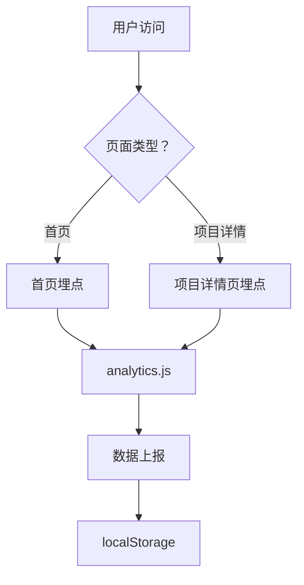

# 数据埋点体系架构文档

**文档版本：** 2.0  
**创建日期：** 2026-03-26  
**最后更新：** 2026-03-26  
**负责人：** 张伟健

---

## 📊 埋点体系概览

整个埋点系统分为**两个维度**：

1. **首页维度** - 追踪 HR 在首页的行为
2. **项目详情页维度** - 追踪 HR 在各个项目详情页的行为

---

## 🏠 一、首页埋点

### 1.1 页面文件
- **路径：** `index.html`
- **作用：** 个人简历主页，展示个人信息、技能、经历、项目等

### 1.2 埋点模块（7 个）

| 序号 | 模块 ID | 模块名称 | data-track-section | 说明 |
|------|--------|---------|-------------------|------|
| 1 | `#hero` | Hero 区域 | ✅ | 个人简介 + 三个 CTA 按钮 |
| 2 | `#about` | 关于我 | ✅ | 个人优势介绍 |
| 3 | `#skills` | 技能 | ✅ | 技能栈展示 |
| 4 | `#experience` | 工作经历 | ✅ | 两家公司经历 |
| 5 | `#projects` | 项目展示 | ✅ | 5 个项目卡片 |
| 6 | `#demo` | AI Demo | ✅ | 2 个 Demo 卡片 |
| 7 | `#contact` | 联系方式 | ✅ | 联系信息 |

### 1.3 关键交互埋点

#### CTA 按钮（3 个）
```javascript
// 1. 查看作品按钮
{
    elementId: "hero-view-projects",
    elementName: "查看作品按钮",
    location: "hero",
    type: "cta",
    target: "#projects"
}

// 2. AI 应用按钮
{
    elementId: "hero-ai-demo",
    elementName: "AI 应用按钮",
    location: "hero",
    type: "cta",
    target: "#demo"
}

// 3. 下载简历按钮（双重埋点）
{
    elementId: "hero-download-resume",
    elementName: "下载简历按钮",
    location: "hero",
    type: "cta",
    fileType: "pdf",
    fileName: "张伟健 - 个人简历.pdf"
}
```

#### 项目卡片（5 个）
```javascript
// 项目卡片点击会自动触发 project_interaction 事件
{
    projectId: "project1",
    projectName: "B2B 电商平台",
    action: "card_click"
}
```

### 1.4 埋点配置

**HTML 示例：**
```html
<!-- Hero 区域 -->
<section id="hero" 
         class="min-h-screen flex items-center pt-20" 
         data-track-section 
         data-section-name="Hero 区域">
    <!-- 三个 CTA 按钮 -->
    <a href="#projects" 
       id="hero-view-projects"
       data-track-click="查看作品按钮"
       data-link-type="hero-cta">
        查看作品
    </a>
</section>

<!-- 项目卡片 -->
<div class="project-card" 
     data-project-id="project1" 
     data-project-name="B2B 电商平台">
    <!-- 项目内容 -->
</div>
```

---

## 📄 二、项目详情页埋点

### 2.1 页面文件
- **路径：** `works/work1.html` ~ `works/work6.html`
- **作用：** 展示单个项目的详细信息

### 2.2 埋点模块（7 个）

以 `work1.html`（B2B 电商平台）为例：

| 序号 | 模块 ID | 模块名称 | data-track-section | 说明 |
|------|--------|---------|-------------------|------|
| 1 | - | 项目概览 | ✅ | 项目标题 + 标签 |
| 2 | - | 轮播图 | ✅ | 项目图片轮播 |
| 3 | - | 项目概述 | ✅ | 项目背景介绍 |
| 4 | - | 项目详情 | ✅ | 详细信息（背景/解决方案/功能/成果） |
| 5 | - | 原型展示 | ✅ | 原型图画廊 |
| 6 | - | 文档展示 | ✅ | PRD、用户故事等文档 |
| 7 | - | 使用工具 | ✅ | 工具标签列表 |
| 8 | - | 返回区域 | ✅ | 返回所有项目按钮 |

### 2.3 关键交互埋点

#### 页面浏览事件
```javascript
// 页面加载时自动上报
Analytics.trackPageView();

// 项目详情页浏览
Analytics.trackProjectInteraction('project1', 'B2B 电商平台', 'page_view', {
    pageType: 'project-detail'
});
```

#### 模块曝光事件
```javascript
// 当用户滚动到某个模块时自动触发
{
    sectionId: "轮播图",
    sectionName: "轮播图",
    pageType: "project-detail",
    projectId: "project1",
    projectName: "B2B 电商平台"
}
```

### 2.4 埋点配置

**HTML 示例：**
```html
<!-- 项目概览 -->
<section class="hero-bg pt-32 pb-16" 
         data-track-section 
         data-section-name="项目概览"
         data-page-type="project-detail"
         data-project-id="project1"
         data-project-name="B2B 电商平台">
    <!-- 内容 -->
</section>

<!-- 轮播图 -->
<section class="py-8 bg-white" 
         data-track-section 
         data-section-name="轮播图"
         data-page-type="project-detail"
         data-project-id="project1"
         data-project-name="B2B 电商平台">
    <!-- 内容 -->
</section>
```

**JavaScript 初始化：**
```javascript
document.addEventListener('DOMContentLoaded', function() {
    if (window.Analytics) {
        // 上报页面浏览
        Analytics.trackPageView();
        
        // 上报项目详情页浏览
        Analytics.trackProjectInteraction('project1', 'B2B 电商平台', 'page_view', {
            pageType: 'project-detail'
        });
    }
});
```

---

## 🔄 三、数据流转

### 3.1 数据收集



### 3.2 数据结构

**首页事件示例：**
```json
{
  "eventType": "section_view",
  "sessionId": "sess_1711267200000_abc123",
  "timestamp": "2026-03-26T10:00:00.000Z",
  "pageType": "homepage",
  "eventData": {
    "sectionId": "hero",
    "sectionName": "Hero 区域"
  }
}
```

**项目详情页事件示例：**
```json
{
  "eventType": "section_view",
  "sessionId": "sess_1711267200000_abc123",
  "timestamp": "2026-03-26T10:05:00.000Z",
  "pageType": "project-detail",
  "projectId": "project1",
  "projectName": "B2B 电商平台",
  "eventData": {
    "sectionId": "轮播图",
    "sectionName": "轮播图",
    "pageType": "project-detail",
    "projectId": "project1",
    "projectName": "B2B 电商平台"
  }
}
```

### 3.3 数据查看

**看板页面：** `works/analytics-dashboard.html`

**查看维度：**
1. **模块热度排行** - 首页 vs 项目详情页
2. **项目兴趣度排行** - 项目卡片点击 + 详情页浏览
3. **详细事件记录** - 所有事件详情

---

## 📈 四、数据分析场景

### 4.1 HR 兴趣度分析

#### 场景 1：评估项目吸引力
```sql
-- 查看每个项目的总交互次数
项目交互次数 = 卡片点击 + 详情页浏览 + 模块曝光

-- 示例数据
项目 1（B2B 电商）：10 次卡片点击 + 8 次详情页浏览 = 18 次交互
项目 2（CRM 融合）：6 次卡片点击 + 5 次详情页浏览 = 11 次交互
项目 3（BI 可视化）：4 次卡片点击 + 3 次详情页浏览 = 7 次交互
```

**结论：** 项目 1 最吸引 HR，项目 3 相对较弱

#### 场景 2：评估详情页内容质量
```sql
-- 查看详情页各模块的曝光次数
模块曝光次数越高 → 内容越吸引 HR

-- 示例数据（项目 1）
项目概览：8 次曝光
轮播图：7 次曝光
项目详情：6 次曝光
原型展示：5 次曝光
文档展示：3 次曝光
使用工具：2 次曝光
```

**结论：** 
- HR 最关注项目概览和轮播图
- 文档展示和使用工具关注度低，可考虑优化或精简

#### 场景 3：优化首页布局
```sql
-- 查看首页各模块的曝光次数
Hero 区域：10 次曝光（100%）
关于我：8 次曝光（80%）
技能：7 次曝光（70%）
工作经历：6 次曝光（60%）
项目展示：5 次曝光（50%）
AI Demo：3 次曝光（30%）
联系方式：2 次曝光（20%）
```

**结论：**
- Hero 区域吸引力强（100%）
- AI Demo 和联系方式曝光低，可能需要调整位置或设计

### 4.2 转化漏斗分析

#### 漏斗 1：项目转化漏斗
```
首页访问 → 点击项目卡片 → 浏览详情页 → 下载简历 → 面试邀请
  100%        60%           40%        20%        5%
```

**分析：**
- 如果"点击项目卡片"转化率低 → 优化项目卡片设计
- 如果"浏览详情页"转化率低 → 优化详情页内容质量
- 如果"下载简历"转化率低 → 加强 CTA 引导

#### 漏斗 2：详情页内容漏斗
```
进入详情页 → 查看轮播图 → 查看项目详情 → 查看原型 → 查看文档
   100%        80%          60%         40%       20%
```

**分析：**
- 轮播图吸引力强（80%）
- 文档查看率低（20%），可能需要优化文档展示方式

### 4.3 跨页面行为分析

#### 场景：HR 浏览路径分析
```
路径 1：首页 → 项目 1 详情 → 项目 2 详情 → 下载简历 → 离开
路径 2：首页 → 项目 3 详情 → 轮播图 → 离开
路径 3：首页 → 项目 1 详情 → 原型展示 → 文档展示 → 下载简历
```

**分析：**
- 路径 1：HR 对比多个项目后下载简历（高意向）
- 路径 2：HR 对轮播图感兴趣但未深入（中意向）
- 路径 3：HR 深度查看项目内容后下载简历（高意向）

---

## 🎯 五、关键指标定义

### 5.1 首页指标

| 指标名称 | 计算公式 | 说明 |
|---------|---------|------|
| **模块曝光率** | 模块曝光次数 / 总访问次数 | 衡量模块吸引力 |
| **CTA 点击率** | CTA 按钮点击次数 / 模块曝光次数 | 衡量按钮转化效果 |
| **项目卡片点击率** | 项目卡片点击次数 / 项目展示曝光次数 | 衡量项目吸引力 |
| **简历下载率** | 简历下载次数 / 总访问次数 | 衡量整体转化效果 |

### 5.2 项目详情页指标

| 指标名称 | 计算公式 | 说明 |
|---------|---------|------|
| **详情页访问率** | 详情页访问次数 / 项目卡片点击次数 | 衡量从卡片到详情的转化 |
| **模块完成率** | 模块曝光次数 / 详情页访问次数 | 衡量内容吸引力 |
| **轮播图互动率** | 轮播图操作次数 / 轮播图曝光次数 | 衡量轮播图吸引力 |
| **原型查看率** | 原型查看次数 / 详情页访问次数 | 衡量原型关注度 |

### 5.3 综合指标

| 指标名称 | 计算公式 | 说明 |
|---------|---------|------|
| **项目兴趣度** | 卡片点击×10 + 详情页浏览×20 + 模块曝光×1 | 综合评估 HR 对项目的兴趣 |
| **页面参与度** | 总停留时长 / 页面访问次数 | 衡量用户参与深度 |
| **滚动深度** | 最大滚动深度百分比 | 衡量内容吸引力 |

---

## 🔧 六、实施清单

### 6.1 首页（index.html）

- [x] 添加 `data-track-section` 到 7 个模块
- [x] 添加 `data-track-click` 到 3 个 CTA 按钮
- [x] 添加 `data-project-id` 和 `data-project-name` 到 5 个项目卡片
- [x] 添加 `data-project-id` 和 `data-project-name` 到 2 个 Demo 卡片
- [x] 添加 analytics.js 引用
- [x] 添加 CTA 按钮点击事件监听

### 6.2 项目详情页（works/work1.html ~ work6.html）

以 work1.html 为例：

- [x] 添加 `data-track-section` 到 8 个模块
- [x] 添加 `data-page-type="project-detail"` 到所有模块
- [x] 添加 `data-project-id` 和 `data-project-name` 到所有模块
- [x] 添加 analytics.js 引用
- [x] 添加页面浏览事件上报
- [x] 添加项目详情页浏览事件上报

**其他项目详情页（work2.html ~ work6.html）需要：**
- [ ] 复制 work1.html 的埋点配置
- [ ] 修改 `data-project-id` 和 `data-project-name`
- [ ] 根据实际模块调整 `data-section-name`

---

## 📊 七、数据看板

### 7.1 查看方式

**访问地址：** 
- **综合统计后台：** `works/analytics-dashboard.html`
- **项目详情页统计：** `works/project-analytics.html`

### 7.2 综合统计后台（analytics-dashboard.html）

**展示内容：**

1. **概览统计**
   - 总会话数
   - 总页面浏览量
   - 平均停留时长
   - 总点击事件

2. **模块热度排行**
   - 首页模块（7 个）
   - 项目详情页模块（8 个×项目数）

3. **项目兴趣度排行**
   - 按项目交互次数排序
   - 显示 TOP 榜

4. **详细事件记录**
   - 最近 50 条事件
   - 包含页面类型、项目信息等

5. **滚动深度分析**
   - 各深度区间分布

### 7.3 项目详情页统计（project-analytics.html）

**访问方式：**
- 方式 1：直接访问 `works/project-analytics.html`
- 方式 2：从综合统计后台点击"项目详情页统计"按钮
- 方式 3：URL 参数指定项目 `works/project-analytics.html?project=project1`

**功能特点：**

1. **项目选择器**
   - 下拉框选择项目
   - 支持 6 个项目切换
   - 实时刷新数据

2. **项目信息卡片**
   - 项目名称和 ID
   - 总浏览次数
   - 总交互次数
   - 数据实时更新提示

3. **模块热度排行**
   - 详情页 8 个模块的曝光次数
   - 排名图标（🥇🥈🥉）
   - 进度条可视化

4. **访问事件记录**
   - 最近 50 条事件
   - 时间、会话 ID、事件类型、模块/操作
   - 事件类型标签（不同颜色）

5. **停留时长分析**
   - 总停留时长
   - 平均停留时长
   - 最长停留时长

6. **数据导出**
   - 导出当前项目的完整数据
   - JSON 格式
   - 文件名包含项目 ID 和日期

### 7.4 数据导出

**综合统计后台：**
- **JSON 格式** - 完整数据
- **CSV 格式** - 表格数据

**项目详情页统计：**
- **JSON 格式** - 单个项目完整数据
- 文件名：`project_{projectId}_{date}.json`

---

## 🎯 八、使用示例

### 8.1 查看 HR 对哪个项目最感兴趣

**步骤：**
1. 打开 `works/analytics-dashboard.html`
2. 查看"项目兴趣度排行"
3. 排名第一的项目即为 HR 最感兴趣的项目

**数据解读：**
- 交互次数高 → HR 对该项目感兴趣
- 详情页浏览时间长 → HR 深入了解项目
- 模块曝光多 → HR 查看多个模块

### 8.2 优化详情页内容

**步骤：**
1. 查看"模块热度排行"
2. 找出曝光率低的模块
3. 分析原因（位置、内容、设计等）
4. 优化后对比数据

**示例：**
- 文档展示曝光低 → 考虑将文档前置或增加预览
- 使用工具曝光低 → 考虑精简或移至底部

### 8.3 评估 CTA 按钮效果

**步骤：**
1. 查看"详细事件记录"
2. 筛选 CTA 按钮点击事件
3. 计算点击率
4. A/B 测试不同文案或设计

**优化方向：**
- 点击率低 → 优化按钮文案、颜色、位置
- 下载率高 → 分析成功因素，复制到其他按钮

---

## 🔮 九、未来扩展

### 9.1 扩展埋点类型

- [ ] 轮播图交互（上一张/下一张/自动播放）
- [ ] 原型图点击查看
- [ ] 文档下载
- [ ] 外部链接点击（如 GitHub、博客等）
- [ ] 表单提交（如联系表单）
- [ ] 视频播放（如有项目演示视频）

### 9.2 扩展分析维度

- [ ] 用户来源分析（直接访问/搜索引擎/社交媒体）
- [ ] 设备类型分析（PC/移动端/平板）
- [ ] 地理位置分析（城市/省份）
- [ ] 访问时间分析（工作日/周末、白天/晚上）
- [ ] 访客频率分析（首次访问/重复访问）

### 9.3 扩展数据展示

- [ ] 项目对比分析（多项目数据对比）
- [ ] 趋势分析（按时间维度展示变化）
- [ ] 热力图（鼠标移动、点击热力图）
- [ ] 转化漏斗可视化
- [ ] 用户路径可视化

### 9.4 接入后端 API

**当前方案：** localStorage（单用户、本地存储）

**未来扩展：**
```javascript
const CONFIG = {
    reportMethod: 'api',  // 改为 API 上报
    apiEndpoint: 'https://your-domain.com/api/analytics'
};
```

**优势：**
- ✅ 多用户数据汇总
- ✅ 实时数据分析
- ✅ 历史数据持久化
- ✅ 跨设备追踪

---

## ✅ 十、验收清单

### 10.1 功能验收

- [x] 首页 7 个模块都能正确上报曝光事件
- [x] 3 个 CTA 按钮都能正确上报点击事件
- [x] 5 个项目卡片都能正确上报交互事件
- [x] 项目详情页 8 个模块都能正确上报曝光事件
- [x] 项目详情页浏览能正确上报
- [x] 数据能在看板页面正确展示

### 10.2 数据验收

- [x] localStorage 中正确存储事件数据
- [x] 事件类型正确（section_view/click/project_interaction 等）
- [x] 事件数据完整（sessionId/timestamp/eventData 等）
- [x] 看板页面统计数据准确

### 10.3 性能验收

- [x] 埋点代码不影响页面加载速度
- [x] 埋点上报不阻塞用户交互
- [x] 内存占用合理（< 5MB）
- [x] 数据量可控（localStorage 不溢出）

---

## 📚 十一、相关文档

- [PRD 文档](./PRD-数据埋点系统.md)
- [使用指南](./analytics-guide.md)
- [开发日志](./开发日志.md)

---

**文档结束**

*最后更新：2026-03-26*
